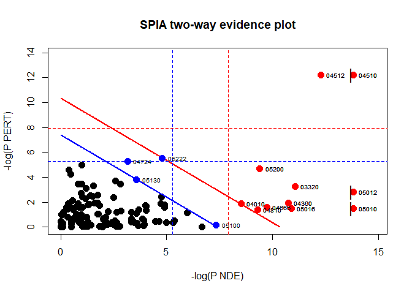

# Pathway Enrichment Analysis
Karina y Jesica Formoso

- [Instalar y cargar los paquetes SPIA, tidyverse y
  hgu133plus2.db.](#instalar-y-cargar-los-paquetes-spia-tidyverse-y-hgu133plus2db)
- [Análisis topológico de enriquecimiento de vías con
  SPIA.](#análisis-topológico-de-enriquecimiento-de-vías-con-spia)
  - [Columnas](#columnas)
  - [Gráficos](#gráficos)
  - [Referencias](#referencias)

Las tecnologías de genómica, transcriptómica y proteómica generan
grandes cantidades de datos que luego deben ser analizados de la manera
más eficaz posible. Una tendencia cada vez más marcada es la de analizar
los genes obtenidos en grupos funcionalmente relacionados. Esto se logra
mediante el **Pathway enrichment analysis**. El objetivo de este método
es identificar grupos de genes con cambios de expresión posiblemente
moderados pero coordinados en diferentes condiciones biológicas. Hay
distintos tipos de análisis que se pueden realizar y se clasifican en:

- Competitivo vs. Autónomo (Competitive vs. Self-contained).
- Topológico vs. no topológico (Topological vs Non-Tophological).

Aquí vamos a utilizar SPIA que es un análisis mixto y topológica. Este
método calcula un valor teniendo en cuenta el fold change de los genes,
el score para el pathway enrichment y la topología de las vías de
señalización. Para trabajar con SPIA es necesario contar con la lista de
genes diferencialmente expresados con sus log fold changes y la lista
completa de genes en la plataforma.

Para este ejemplo vamos a utilizar la base de datos **colorectal cancer
\[Affymetrix geneChip technology (GEE GSE4107)\]** y los paquetes SPIA,
hgu133plus2.db y tidyverse:

### Instalar y cargar los paquetes SPIA, tidyverse y hgu133plus2.db.

``` r
# if (!require("BiocManager", quietly = TRUE))
#    install.packages("BiocManager")
# BiocManager::install("SPIA")
# BiocManager::install("hgu133plus2.db")
 
# install.packages(tidyverse)

library(tidyverse)
library(SPIA)
library(hgu133plus2.db)
select <- dplyr::select
```

## Análisis topológico de enriquecimiento de vías con SPIA.

Vamos a cargar el set de datos **colorectalcancer**, el cual incluye un
dataset llamado “top”. Con la función head() podemos ver las primeras 6
observaciones o filas.

``` r
data(colorectalcancer)
head(top)
```

                   ID    logFC  AveExpr        t      P.Value    adj.P.Val        B
    10738   201289_at 5.960206 6.226928 23.94388 1.789221e-17 9.782565e-13 25.40124
    18604   209189_at 5.143502 7.487305 17.42995 1.560212e-14 2.843486e-10 21.02120
    11143 201694_s_at 4.148081 7.038281 16.46040 5.153117e-14 7.043667e-10 20.14963
    10490 201041_s_at 2.429889 9.594413 14.06891 1.293706e-12 1.414667e-08 17.66883
    10913 201464_x_at 1.531126 8.221044 10.98634 1.685519e-10 1.151947e-06 13.61189
    11463   202014_at 1.429269 5.327647 10.45906 4.274251e-10 2.418771e-06 12.80131
          ENTREZ
    10738   3491
    18604   2353
    11143   1958
    10490   1843
    10913   3725
    11463  23645

Usamos el paquete hgu133plus2.db que contiene Affymetrix Human Genome
U133 Plus 2.0 Array annotation data para asignarle a cada ID de la base
**top** un **ENTREZ ID**.

``` r
x <- hgu133plus2ENTREZID
top$ENTREZ <- unlist(as.list(x[top$ID]))
```

Vamos a seleccionar las observaciones que no tengan datos faltantes y
eliminar los datos duplicados en ENTREZ. Como las observaciones están
ordenadas según el log2FoldChange (logFC en la base), al quedarnos con
la primera aparición de cada ENTREZ, retenemos la más significativa de
cada probset.

``` r
top <- top %>% 
  filter(!is.na(ENTREZ),
         !duplicated(ENTREZ))
```

Además, vamos a seleccionar las observaciones que tienen un p-valor
ajustado menor a 0.1.

``` r
tg1 <- filter(top, adj.P.Val < 0.1)
```

Luego, creamos un vector con los valores de logFC de la nueva base y
utilizamos la variable ENTREZ para nombrar los valores del vector.

``` r
DE_Colorectal <- tg1$logFC
names(DE_Colorectal) <- tg1$ENTREZ
```

Creamos un segundo vector con los ENTREZ de la base TOP. Esta es la base
original pero sin los valores faltantes o repetidos.

``` r
ALL_Colorectal <- top$ENTREZ
```

Corremos el análisis utilizando la función SPIA(). Utilizamos el método
de “fisher” para estudiar la significancia de la representación de
nuestros genes en la vía de señalización.

``` r
resultados <- spia(de = DE_Colorectal, all = ALL_Colorectal, organism = "hsa", nB = 2000, plots = TRUE, verbose = TRUE, combine = "fisher")
```

Eliminemos la columna “KEGGLINK” y veamos las primeras líneas de
nuestros resultados:

``` r
resultados %>% 
  select(-KEGGLINK) %>% 
  head()
```

                          Name    ID pSize NDE         pNDE         tA    pPERT
    1           Focal adhesion 04510   177  88 1.984232e-07 100.644774 0.000005
    2      Alzheimer's disease 05010   148  84 1.024602e-10  -5.654716 0.228000
    3 ECM-receptor interaction 04512    74  42 4.684224e-06  26.061813 0.000005
    4      Parkinson's disease 05012   109  64 2.616512e-09 -11.129862 0.060000
    5   PPAR signaling pathway 03320    65  37 1.556513e-05  -3.051555 0.039000
    6       Pathways in cancer 05200   295 123 8.310528e-05  68.667286 0.009000
                pG        pGFdr       pGFWER    Status
    1 2.841315e-11 3.892601e-09 3.892601e-09 Activated
    2 5.952356e-10 2.724970e-08 8.154727e-08 Inhibited
    3 5.967088e-10 2.724970e-08 8.174911e-08 Activated
    4 3.701030e-09 1.267603e-07 5.070412e-07 Inhibited
    5 9.296617e-06 2.547273e-04 1.273637e-03 Inhibited
    6 1.129844e-05 2.579812e-04 1.547887e-03 Activated

El output obtenido es el siguiente:

### Columnas

- pSize: el número de genes en la vía de señalización.
- NDE: el número de genes diferencialmente expresados en esta vía.
- tA: la acumulación total de perturbaciones observadas en la vía.
- pNDE: la probabilidad (p-valor) de observar al menos genes NDE en la
  vía utilizando un modelo hipergeométrico (similar a ORA)
- pPERT: la probabilidad (p-valor) de observar una acumulación total más
  extrema que tA solo por casualidad
- pG: el p-valor obtenido al combinar pNDE y pPERT
- pGFdr y pGFWER: los valores pG ajustados por la tasa de descubrimiento
  falso (FDR) y el método de Bonferroni, respectivamente.
- State: indica si la vía está inhibida o activada.
- KEGGLINK: proporciona un enlace web al sitio web de KEGG que muestra
  la imagen de la ruta con los genes expresados diferencialmente
  resaltados en rojo.

### Gráficos

Como indicamos a la función SPIA que genere los gráficos asociados a
estos resultados (plots = TRUE), estos se guardan como un archivo pdf en
el directorio en el que estamos trabajando.

Podemos ver las vías significativamente desreguladas al ver la
sobrerrepresentación y las perturbaciones de cada vía.

``` r
plotP(resultados, threshold = 0.05)
```



En este gráfico, cada vía es un punto y las coordenadas son el logaritmo
de pNDE (usando un modelo hipergeométrico) y el p-valor de las
perturbaciones (pPERT). Las líneas oblicuas muestran las regiones de
importancia según la evidencia combinada.

### Referencias

- Tarca AL, Kathri P, Draghici S (2024). SPIA: Signaling Pathway Impact
  Analysis (SPIA) using combined evidence of pathway over-representation
  and unusual signaling perturbations. R package version 2.56.0,
  http://bioinformatics.oxfordjournals.org/cgi/reprint/btn577v1.
- Wickham H, Averick M, Bryan J, Chang W, McGowan LD, François R,
  Grolemund G, Hayes A, Henry L, Hester J, Kuhn M, Pedersen TL, Miller
  E, Bache SM, Müller K, Ooms J, Robinson D, Seidel DP, Spinu V,
  Takahashi K, Vaughan D, Wilke C, Woo K, Yutani H (2019). “Welcome to
  the tidyverse.” Journal of Open Source Software, 4(43), 1686.
  doi:10.21105/joss.01686.
- Carlson M (2016). hgu133plus2.db: Affymetrix Human Genome U133 Plus
  2.0 Array annotation data (chip hgu133plus2). R package version 3.2.3.
